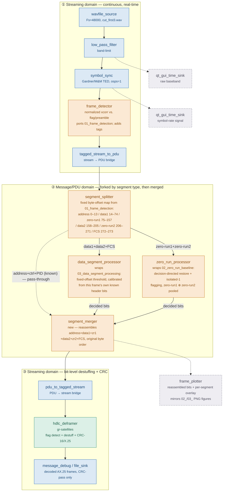

# GNU Radio Migration Proposal (Draft v2) — forked by segment type

> **Status: draft for review, not implemented.** Proposes one way to move the `scionx/`
> diagnostic pipeline (see the main [README.md](README.md)) into a GNU Radio Companion (GRC)
> flowgraph, once a decision method for the data/zero-run segments is settled.

## Why this shape

GNU Radio's stream abstraction is built for continuous, per-sample, real-time processing.
Two of the three diagnostic folders in this repo are exactly that kind of thing — but the
middle one isn't:

- `01_frame_detection/`'s normalized cross-correlation needs to see a whole candidate window
  before it can decide anything — not a per-sample operation.
- `scionx/baseline.py`'s `restore_baseline` re-scans a whole ~2001-sample window, seven times,
  per frame — an iterative, whole-buffer algorithm, not a causal filter.
- `02_zero_run_baseline/` and `03_data_segment_processing/` each apply a *different* decision
  method, to a *different* subset of the frame's bytes. FCS (the 2-byte CRC) rides along with
  the data segments rather than getting its own pass-through: its bits look like arbitrary
  signal content, not the all-zero padding `zero_run_processor` is tuned for, so
  `data_segment_processor`'s asymmetry-corrected threshold is the better fit for it too.

So instead of forcing everything into per-sample streaming blocks, the flowgraph below brackets
the frame-level diagnostic work off as a **per-frame message/PDU stage**, sandwiched between a
real-time streaming front end and a real-time streaming back end (`hdlc_deframer`, CRC).
Inside that message stage, the frame is **forked by segment type** — data segments go to the
processor built for them, zero-run segments go to the processor built for them — then merged
back into one ordered bit stream before CRC.

## Flowgraph

**Legend**: blue = stock GNU Radio block, unmodified · green = `gr-satellites` (already used) ·
amber = custom Python block that reuses `scionx/*.py` numpy code as-is · grey dashed =
visualization/debug sink, not on the decode path · solid arrow = stream connection
(continuous) · dashed arrow = message/PDU connection (one shot per frame).

## Block reference

| Block | Kind | Role |
|---|---|---|
| `wavfile_source` | native GR | Reads `cut_first3.wav` (pre-converted once from `.ogg`), Fs=48000 Hz |
| `low_pass_filter` | native GR | Band-limits before timing recovery |
| `symbol_sync` | native GR | Gardner/M&M TED, `osps=1` — replaces the current fixed `PHASE`/`SPS` sampling (see README "Possible future updates") |
| `frame_detector` | custom | Ports `01_frame_detection/`'s normalized cross-correlation; on detection, tags `frame_start`/`frame_len` |
| `tagged_stream_to_pdu` | native GR | Buffers samples between tags into one PDU per detected frame |
| `segment_splitter` | custom | Applies the fixed byte-offset segment map (same one `01_frame_detection/` derives from `REFERENCE_FRAME.md`) to route each span; address is the only span still passed straight through |
| `data_segment_processor` | custom | Wraps `03_data_segment_processing/`'s fixed-offset threshold + asymmetry check; also carries the FCS bytes (272–273), treated as data rather than pass-through |
| `zero_run_processor` | custom | Wraps `02_zero_run_baseline/`'s decision-directed baseline restoration + isolated-1 flagging (zero-run1/zero-run2 pooled, as the current script does) |
| `segment_merger` | custom, new | The one genuinely new piece — reassembles all spans into one bit stream in original byte order |
| `pdu_to_tagged_stream` | native GR | Converts the merged decided-bit PDU back into a bit stream |
| `hdlc_deframer` | gr-satellites | Real flag detection + bit-destuffing + CRC-16/X.25 (existing OOT module) |
| `message_debug` / `file_sink` | native GR | Emits only when a frame passes CRC |
| `qt_gui_time_sink` ×2, `frame_plotter` | viz/debug | Live inspection taps; `frame_plotter` mirrors the current `02_`/`03_` static PNG figures |

## Open question

The fork in `segment_splitter` runs on a **fixed** byte-offset map, derived once from
`REFERENCE_FRAME.md`'s ground-test frame. That's valid only if every frame from this satellite
keeps telemetry fields at the same byte positions. If the layout ever shifts between frames,
`segment_splitter` would silently route bytes to the wrong processor *before* either
`data_segment_processor` or `zero_run_processor` gets a chance to run — worth confirming this
assumption holds across more than the 2–3 frames currently on hand.
